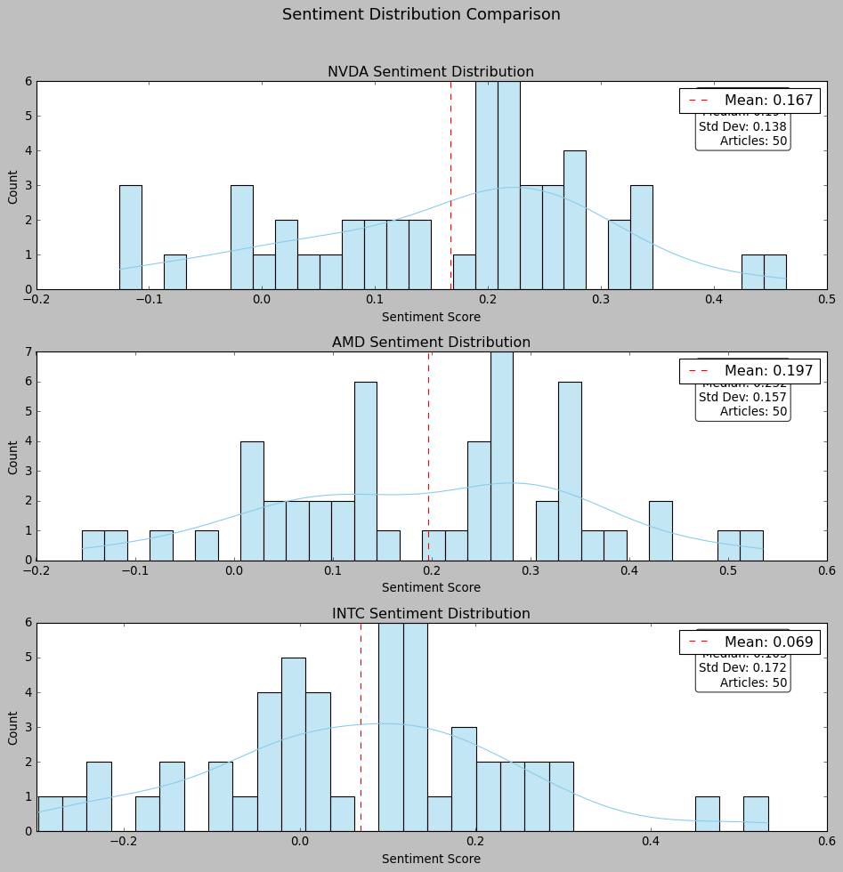
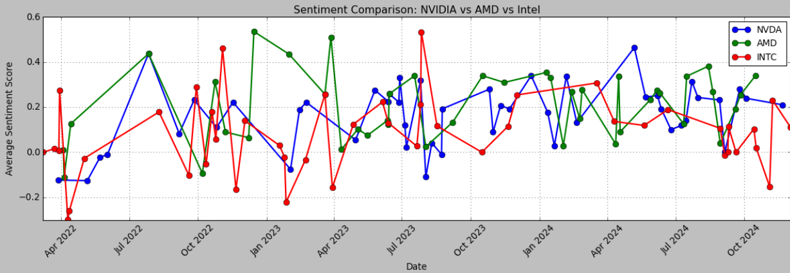
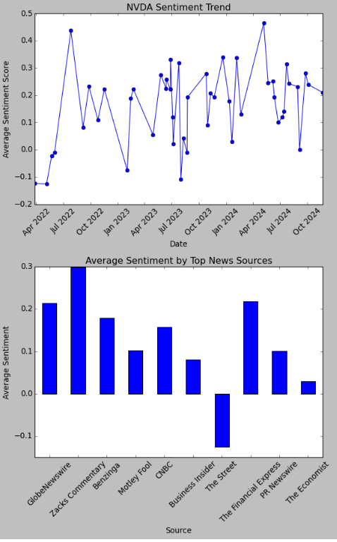

News Sentiment Analysis with Alphavantage
=========================================

The news sentiment analysis component is a crucial part of the AUTOtrade system, responsible for gathering and analyzing financial news to generate sentiment signals. This module primarily uses AlphaVantage's News Sentiment API to collect and process news data.

Architecture Overview
---------------------

The news sentiment analysis system consists of two main components:

1. **API Key Rotator**: Manages API keys and handles rate limiting
2. **Stock News Analyzer**: Processes and analyzes news data

API Key Rotation System
------------------------

The ``APIKeyRotator`` class manages multiple API keys to ensure reliable data fetching:

.. code-block:: python

    class APIKeyRotator:
        def __init__(self, api_keys: List[str], base_url: str):
            """
            Initialize the API key rotator with a list of API keys and base URL.
            
            Args:
                api_keys (List[str]): List of API keys to rotate through
                base_url (str): Base URL for the API
            """
            self.api_keys = api_keys
            self.base_url = base_url
            self.current_key_index = 0
            self.failed_keys = set()
            self.last_request_time = 0
            self.rate_limit_wait = 12  # Wait time in seconds between requests

Key features:
- Automatic rotation between multiple API keys
- Rate limiting protection
- Failed key tracking
- Error handling and retry logic

Stock News Analysis System
---------------------------

The ``StockNewsAnalyzer`` class provides comprehensive news analysis capabilities:

.. code-block:: python

    class StockNewsAnalyzer:
        def __init__(self, api_rotator: APIKeyRotator):
            self.api_rotator = api_rotator
            self.news_cache = {}  # Cache for storing news data
            self.cache_duration = timedelta(hours=1)  # Cache duration
            self.cache_timestamps = {}  # Timestamps for cached data

Key Functionality
~~~~~~~~~~~~~~~~~

1. **News Fetching with Caching**:

.. code-block:: python

    def fetch_news(self, ticker: str) -> Optional[Dict]:
        if ticker in self.news_cache:
            if datetime.now() - self.cache_timestamps[ticker] < self.cache_duration:
                return self.news_cache[ticker]
                
        params = {
            "function": "NEWS_SENTIMENT",
            "tickers": ticker,
            "sort": "RELEVANCE"
        }

2. **Sentiment Analysis Features**:
   - Distribution analysis of sentiment scores
   - Time-based sentiment tracking
   - Cross-ticker sentiment comparison
   - Top article identification

Usage 
------

Here's how to use the news sentiment analysis system:

.. code-block:: python

    # Initialize the system
    API_KEYS = ["YOUR_KEY_1", "YOUR_KEY_2"]
    BASE_URL = "https://www.alphavantage.co/query"
    
    api_rotator = APIKeyRotator(API_KEYS, BASE_URL)
    analyzer = StockNewsAnalyzer(api_rotator)

    # Compare multiple stocks
    tech_tickers = ['NVDA', 'AMD', 'INTC', 'AAPL']
    comparison = analyzer.compare_tickers_news(tech_tickers)

    # Get detailed timeline for a specific stock
    nvidia_timeline = analyzer.get_sentiment_timeline('NVDA', days=7)

Key Features
-------------

1. **Sentiment Distribution Analysis**:
   - Average sentiment scores
   - Sentiment label distribution
   - Maximum and minimum sentiment articles
   - Standard deviation of sentiment

2. **Multi-Stock Comparison**:
   - Article count per stock
   - Average sentiment across stocks
   - Recent sentiment trends
   - Most common sentiment labels

3. **Timeline Analysis**:
   - Daily sentiment aggregates
   - Trend analysis over specified time periods
   - Statistical measures (mean, standard deviation)

4. **Caching System**:
   - Reduces API calls
   - Configurable cache duration
   - Automatic cache invalidation

Error Handling
---------------

The system includes robust error handling:
- API key rotation on failure
- Rate limit management
- Failed request tracking
- Data validation checks

Configuration
-------------

Key configuration parameters:

.. code-block:: python

    # API Configuration
    rate_limit_wait = 12  # seconds between requests
    cache_duration = timedelta(hours=1)  # news cache duration

Performance Considerations
--------------------------

1. **Rate Limiting**:
   - Respects API rate limits
   - Implements waiting periods between requests
   - Rotates through multiple API keys

2. **Caching**:
   - Reduces API calls
   - Improves response time
   - Configurable cache duration

3. **Error Recovery**:
   - Automatic failover to backup API keys
   - Retry mechanism for failed requests
   - Graceful degradation on API exhaustion
   

Sentiment Visualization
------------------------

The sentiment analysis system includes visualization capabilities here are some key visualization features and their implementations.

Distribution Analysis
~~~~~~~~~~~~~~~~~~~~~~

The system can generate comparative sentiment distribution visualizations across multiple tickers:

   
   Sentiment distribution comparison for NVIDIA, AMD, and Intel showing the frequency of different sentiment scores.

.. code-block:: python

    def generate_sentiment_distributions(self, tickers: List[str]) -> plt.Figure:
        """Generate comparative sentiment distribution plots for multiple tickers"""
        fig, axes = plt.subplots(len(tickers), 1, figsize=(10, 4*len(tickers)))
        fig.suptitle('Sentiment Distribution Comparison')
        
        for i, ticker in enumerate(tickers):
            news = self.fetch_news(ticker)
            if news and 'feed' in news:
                df = self.news_to_dataframe(news)
                if not df.empty:
                    sentiment_data = df['overall_sentiment_score']
                    mean = sentiment_data.mean()
                    std = sentiment_data.std()
                    
                    # Create histogram and distribution curve
                    axes[i].hist(sentiment_data, bins=20, color='lightblue')
                    axes[i].axvline(mean, color='red', linestyle='--')
                    
                    axes[i].set_title(f'{ticker} Sentiment Distribution')
                    
        return fig

Temporal Analysis
~~~~~~~~~~~~~~~~~

The system provides temporal analysis of sentiment trends across companies:

   
   Temporal comparison of sentiment scores across NVIDIA, AMD, and Intel showing trends and patterns.

.. code-block:: python

    def plot_sentiment_comparison(self, tickers: List[str], days: int = 30) -> plt.Figure:
        """Generate a comparative sentiment trend plot for multiple tickers"""
        fig, ax = plt.subplots(figsize=(12, 6))
        colors = ['blue', 'green', 'red']
        
        for ticker, color in zip(tickers, colors):
            timeline_df = self.get_sentiment_timeline(ticker, days)
            if not timeline_df.empty:
                ax.plot(timeline_df['date'], 
                       timeline_df['overall_sentiment_score']['mean'],
                       color=color, marker='o', label=ticker)
        
        ax.set_title('Sentiment Comparison: ' + ' vs '.join(tickers))
        return fig

Source Analysis
~~~~~~~~~~~~~~~

The system provides analysis of sentiment patterns across different news sources:

   
   Analysis of average sentiment scores across different news sources, showing variation in reporting sentiment.

.. code-block:: python

    def plot_source_analysis(self, ticker: str) -> plt.Figure:
        """Generate a bar plot of average sentiment by news source"""
        fig, (ax1, ax2) = plt.subplots(2, 1, figsize=(10, 12))
        
        timeline_df = self.get_sentiment_timeline(ticker)
        ax1.plot(timeline_df.index, timeline_df['overall_sentiment_score'], 
                color='blue', marker='o')
        ax1.set_title(f'{ticker} Sentiment Trend')
        ax1.set_ylabel('Average Sentiment Score')
        
        news = self.fetch_news(ticker)
        if news and 'feed' in news:
            df = self.news_to_dataframe(news)
            source_sentiment = df.groupby('source')['overall_sentiment_score'].mean()
            
            ax2.bar(range(len(source_sentiment)), source_sentiment, color='blue')
            ax2.set_xticks(range(len(source_sentiment)))
            ax2.set_xticklabels(source_sentiment.index, rotation=45, ha='right')
            ax2.set_title('Average Sentiment by Top News Sources')
            ax2.set_ylabel('Average Sentiment')
        
        plt.tight_layout()
        return fig

Usage Example
--------------

Here's how to generate these visualizations:

.. code-block:: python

    analyzer = StockNewsAnalyzer(api_rotator)
    
    # Generate visualizations for tech companies
    tech_tickers = ['NVDA', 'AMD', 'INTC']
    
    # Create distribution plots
    dist_fig = analyzer.generate_sentiment_distributions(tech_tickers)
    dist_fig.savefig('sentiment_distributions.png')
    
    # Create temporal comparison
    comp_fig = analyzer.plot_sentiment_comparison(tech_tickers)
    comp_fig.savefig('sentiment_comparison.png')

    # Create source analysis visualization
    source_fig = analyzer.plot_source_analysis('NVDA')
    source_fig.savefig('source_analysis.png')

RSS News Sentiment Analysis
===========================

The RSS news sentiment analysis component provides a secondary source of financial sentiment data through RSS feeds and FinBERT-based sentiment analysis. This module complements the AlphaVantage news data by providing broader market coverage and real-time news updates.

System Components
------------------

The system consists of three main components:

1. **Financial News Fetcher**: Collects news from RSS feeds
2. **Financial Sentiment Analyzer**: Analyzes news sentiment using FinBERT
3. **Utilities**: Handles file operations and output management

News Fetcher
-------------

The ``FinancialNewsFetcher`` class manages RSS feed collection and processing:

.. code-block:: python

    class FinancialNewsFetcher:
        def __init__(self):
            self.default_feeds = {
                'Yahoo Finance': 'https://finance.yahoo.com/news/rssindex',
                'MarketWatch': 'http://feeds.marketwatch.com/marketwatch/topstories/',
                'CNBC': 'https://www.cnbc.com/id/10000664/device/rss/rss.html'
            }
            self.feeds = self.default_feeds.copy()

Key Features:
- Multiple RSS feed support
- Feed management (add/remove/reset)
- Date filtering
- Keyword-based filtering
- Robust error handling

Sentiment Analysis
------------------

The ``FinancialSentimentAnalyzer`` class uses the FinBERT model for sentiment analysis:

.. code-block:: python

    class FinancialSentimentAnalyzer:
        def __init__(self, batch_size: int = 8, device: str = None):
            self.tokenizer = AutoTokenizer.from_pretrained("ProsusAI/finbert")
            self.model = AutoModelForSequenceClassification.from_pretrained("ProsusAI/finbert")
            self.model = self.model.to(self.device)
            self.labels = ['negative', 'neutral', 'positive']

Features:
- Batch processing for efficiency
- GPU support
- Text preparation and cleaning
- Confidence scores
- Detailed sentiment statistics

Usage 
------

Here's how to use the RSS news sentiment analysis system:

.. code-block:: python

    # Initialize components
    fetcher = FinancialNewsFetcher()
    analyzer = FinancialSentimentAnalyzer()

    # Fetch recent news
    start_date = datetime.now() - timedelta(days=2)
    recent_news = fetcher.fetch_all_feeds(start_date=start_date)

    # Analyze sentiment
    news_with_sentiment = analyzer.analyze_dataframe(recent_news)
    sentiment_summary = analyzer.get_sentiment_summary(news_with_sentiment)

Output Management
------------------

The system includes utilities for managing outputs:

.. code-block:: python

    def setup_output_directory(directory: str = "output") -> str:
        if not os.path.exists(directory):
            os.makedirs(directory)
        return directory

    def save_json_output(data: str, filename: str, directory: str = "output") -> str:
        filepath = os.path.join(directory, filename)
        with open(filepath, 'w', encoding='utf-8') as f:
            json.dump(json.loads(data), f, indent=2, ensure_ascii=False)
        return filepath

Key Features
-------------

1. **News Collection**:
   - Multiple financial news sources
   - Customizable RSS feed list
   - Date-based filtering
   - Keyword filtering
   - Full text content extraction

2. **Sentiment Analysis**:
   - FinBERT-based analysis
   - Batch processing
   - Multiple sentiment classes (negative, neutral, positive)
   - Confidence scores
   - Summary statistics

3. **Data Management**:
   - JSON output format
   - Timestamped files
   - Organized directory structure
   - Error handling and logging

Configuration
--------------

The system can be configured through several parameters:

.. code-block:: python

    # RSS Feed Configuration
    default_feeds = {
        'Yahoo Finance': 'https://finance.yahoo.com/news/rssindex',
        'MarketWatch': 'http://feeds.marketwatch.com/marketwatch/topstories/',
        'CNBC': 'https://www.cnbc.com/id/10000664/device/rss/rss.html'
    }

    # Sentiment Analysis Configuration
    batch_size = 8  # Number of texts to process at once
    device = 'cuda' if torch.cuda.is_available() else 'cpu'

Performance Considerations
--------------------------

1. **RSS Feed Fetching**:
   - Rate limiting for server politeness
   - Error handling for failed feeds
   - Caching mechanisms

2. **Sentiment Analysis**:
   - Batch processing for efficiency
   - GPU acceleration when available
   - Text length optimization

3. **Output Management**:
   - Efficient file handling
   - Organized directory structure
   - JSON format for interoperability

Integration Points
-------------------

The RSS sentiment analysis system integrates with the broader AUTOtrade system by:

1. Providing complementary sentiment data to AlphaVantage
2. Supporting the same sentiment scale and format
3. Offering real-time news updates
4. Contributing to the overall sentiment score

Error Handling and Logging
--------------------------

The system includes error handling:

.. code-block:: python

    try:
        news = fetcher.fetch_all_feeds(start_date=start_date)
        news_with_sentiment = analyzer.analyze_dataframe(news)
    except Exception as e:
        logger.error(f"An error occurred: {str(e)}")
        raise