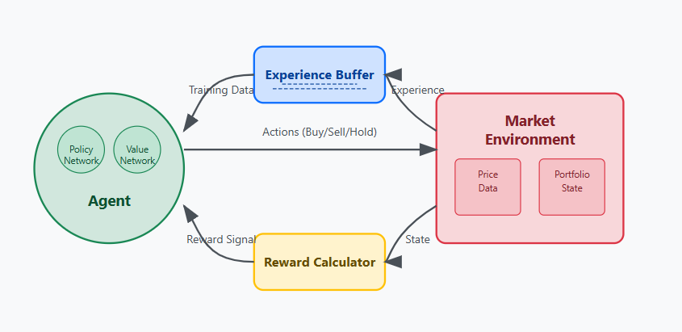

Future Developments and Perspectives
=====================================

Our roadmap for enhancing the AUTOtrade system on many areas:

Reinforcement Learning Integration
-----------------------------------

We aim to add a reinforcement learning framework for our trading agent:

The RL agent will learn optimal trading strategies through continuous interaction with the market environment, utilizing:

* Experience buffer for historical trading patterns
* Policy and value networks for decision optimization
* Sophisticated reward calculation incorporating multiple metrics
* State representation combining technical and sentiment data

System Enhancements
--------------------

Orchestration Improvements
~~~~~~~~~~~~~~~~~~~~~~~~~~
* Better service coordination
* Enhanced fault tolerance and recovery
* Automated scaling based on market activity

Scoring System Refinement
~~~~~~~~~~~~~~~~~~~~~~~~~
* Integration of additional market indicators
* Better weighting mechanisms
* Real-time score validation

Processing Capabilities
~~~~~~~~~~~~~~~~~~~~~~~
* Distributed computing infrastructure
* Real-time stream processing
* Advanced data pipeline optimization

Market Coverage
~~~~~~~~~~~~~~~
* Coverage of additional asset classes:
 - Commodities
 - Fixed income
 - Cryptocurrencies
 - Derivatives
