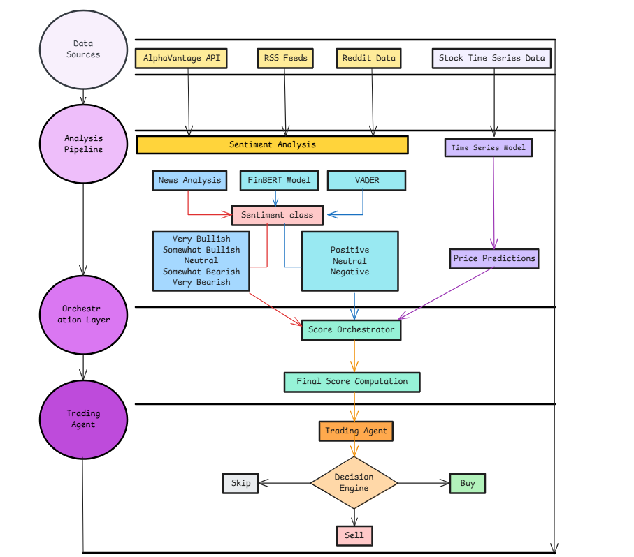

Architecture Overview
======================

   AUTOtrade System Architecture Diagram

The AUTOtrade system consists of four main layers that work together to provide automated trading decisions.

Data Sources Layer
-------------------
This layer is responsible for gathering raw data from various sources:

* **AlphaVantage API**: Provides real-time news with sentiment analysis
* **RSS Feeds**: Delivers current news and market updates from various financial sources
* **Reddit Data**: Collects social sentiment and discussions from relevant financial subreddits
* **Stock Time Series Data**: Historical price and volume data for targeted stocks

Analysis Pipeline Layer
------------------------
This layer processes and analyzes the collected data through many components:

* **Sentiment Analysis**:
    * News Analysis: Processes news articles and financial reports
    * FinBERT Model: A financial-domain BERT model for natural language processing
    * VADER: Sentiment analysis tool specifically tuned for social media content

* **Sentiment Classifications**:
    * Market Sentiment (AlphaVantage API): Very Bullish, Somewhat Bullish, Neutral, Somewhat Bearish, Very Bearish
    * Market Sentiment (News/FinBERT): Positive, Neutral, Negative
    * Social Sentiment (VADER): Positive, Neutral, Negative

* **Time Series Model**:
    * Processes historical stock data
    * Generates price predictions based on technical analysis

Orchestration Layer
--------------------
This layer coordinates and combines the outputs from various analysis components:

* **Score Orchestrator**: 
    * Aggregates sentiment scores from different sources
    * Combines technical analysis predictions
    * Weights different signals based on their reliability and importance

* **Final Score Computation**:
    * Produces a unified score that represents the overall trading signal
    * Normalizes different inputs into a consistent scale
    * Applies business rules and risk management parameters

Trading Agent Layer
--------------------
The final layer that makes and executes trading decisions:

* **Trading Agent**:
    * Receives the computed final score
    * Applies trading strategy rules
    * Manages position sizing and risk parameters

* **Decision Engine**:
    * Outputs one of three possible decisions:
        * Buy: When signals indicate strong positive outlook
        * Sell: When signals indicate strong negative outlook
        * Skip: When signals are unclear or neutral
