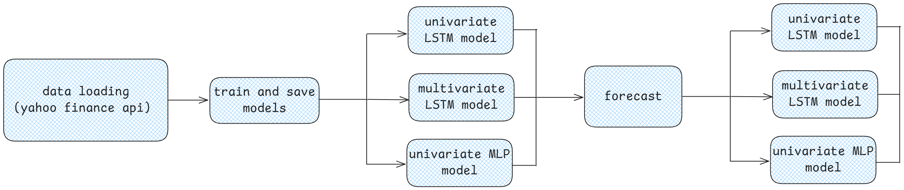

Stock Prediction with Time Series Data
=========================

In this project, we train two models, **LSTM** and **MLP**, to predict stock market trends.

Overview
--------
- **LSTM (Long Short-Term Memory):**
  LSTM is a type of recurrent neural network (RNN) that can learn and retain long-term dependencies. It is particularly well-suited for sequential data, such as time series or stock market data.

- **MLP (Multi-Layer Perceptron):**
  MLP is a feedforward artificial neural network model. It consists of multiple layers of neurons, including an input layer, one or more hidden layers, and an output layer. MLP is commonly used for supervised learning tasks like regression and classification.

Pipeline
--------

   Stock Prediction Pipeline (Excalidraw Image)

Explanation of the Pipeline
---------------------------

The stock prediction pipeline involves the following steps:

1. **Data Loading:**
   - In this step, we load data using the Yahoo Finance API. The API allows us to specify:
     - **Stock Name:** The stock for which data is to be retrieved.
     - **Period:** The look-back period to retrieve historical data.
     - **Interval:** The time interval between consecutive data points.

   Below is a code snippet illustrating how data is loaded:

   .. code-block:: python

      import yfinance as yf

      # Download stock data
      stock_data = yf.download(self.stock_name, period=self.period, interval=self.interval)

2. **Train and Save Models:**
   - In this step, we train three models: two LSTM models (univariate and multivariate) and one MLP model (univariate).

   2.1 **LSTM Univariate:**
   - This model uses only the "Close" column for training. A look-back window is created, and the data is scaled before training the LSTM model. The trained model is saved in `.h5` format.

   .. code-block:: python

      def train_lstm_univariate(self):
          scaler = MinMaxScaler()
          data_close = self.data['Close']
          df_windowed, df_target = self.window_data_univariate(data_close.to_numpy().reshape(-1, 1), self.window_size)
          X_train, y_train, X_test, y_test = self.preprocess_data(df_windowed, df_target)
          model = self.build_lstm_model(X_train)
          model.fit(X_train, y_train, epochs=100, batch_size=32, validation_split=0.1, verbose=1)
          model.save(f'models/{self.stock_name}/LSTM_univariate.h5')

   2.2 **LSTM Multivariate:**
   - This model uses multiple features (`['Close', 'High', 'Low', 'Volume']`) for training. The approach is similar to the univariate model but uses multiple features as input. The trained model is saved in `.h5` format.

   .. code-block:: python

      def train_lstm_multivariate(self):
          scaler = MinMaxScaler()
          data = self.data[['Close', 'High', 'Low', 'Volume']]
          data_close = self.data['Close']
          df_windowed, df_target = self.window_data_multivariate(data.to_numpy(), data_close.to_numpy().reshape(-1, 1), self.window_size)
          X_train, y_train, X_test, y_test = self.preprocess_data(df_windowed, df_target)
          model = self.build_lstm_model(X_train)
          model.fit(X_train, y_train, epochs=100, batch_size=32, validation_split=0.1, verbose=1)
          model.save(f'models/{self.stock_name}/LSTM_multivariate.h5')

   2.3 **MLP Univariate:**
   - This model uses the same approach as the LSTM univariate model but replaces the LSTM with an MLP model. The trained model is saved in `.pkl` format.

   .. code-block:: python

      def train_mlp_univariate(self):
          scaler = MinMaxScaler()
          data_close = self.data['Close']
          df_windowed, df_target = self.window_data_univariate(data_close.to_numpy().reshape(-1, 1), self.window_size)
          X_train, y_train, X_test, y_test = self.preprocess_data(df_windowed, df_target)
          model = self.build_mlp_model()
          model.fit(X_train.reshape(X_train.shape[0], -1), y_train)
          output_dir = f'models/{self.stock_name}'
          os.makedirs(output_dir, exist_ok=True)
          with open(f'models/{self.stock_name}/MLP_univariate.pkl', 'wb') as file:
              pickle.dump(model, file)

3. **Forecast:**
   - Using the trained models, we generate forecasts for the stock prices.

   3.1 **LSTM Univariate Forecast:**
   - This uses the LSTM univariate model to predict stock prices for the next `n_instances` based on the "Close" feature.

   3.2 **LSTM Multivariate Forecast:**
   - This uses the LSTM multivariate model to predict stock prices for the next `n_instances` using multiple features (`['Close', 'High', 'Low', 'Volume']`).

   3.3 **MLP Univariate Forecast:**
   - This uses the MLP univariate model to predict stock prices for the next `n_instances` based on the "Close" feature.

   Below is an example forecast function:

   .. code-block:: python

      def forecast(self, n_instances: int = 7):
          return {
              'LSTM_univariate': self.forecast_lstm_univariate(n_instances),
              'LSTM_multivariate': self.forecast_lstm_multivariate( n_instances),
              'MLP_univariate': self.forecast_mlp_univariate(n_instances)
          }